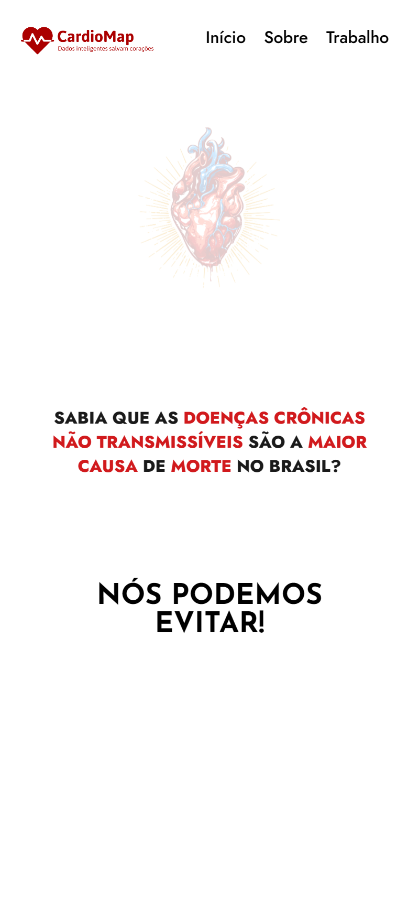

># TechSertão - CardioMap

## Projeto completo!

## Sobre o projeto
        Esse projeto foi desenvolvido de modo a servir de auxílio para a participação do meu
        grupo na primeira Maratona de Inovação Tech Sertão UFAL campus Delmiro Gouveia. Onde o
        objetivo do nosso grupo foi apresentar uma solução relacionado a tecnologia na área da
        saúde.
        Mais detalhes em: Link do post do linkedin em breve!
        

># 🔗 [Acesse clicando aqui!](https://luandersonalvesdev.github.io/tech-sertao/)

## 🛠️ FERRAMENTAS USADAS 
- HTML5
- CSS3

## CONTATO

https://linkedin.com/in/luandersonalvesdev